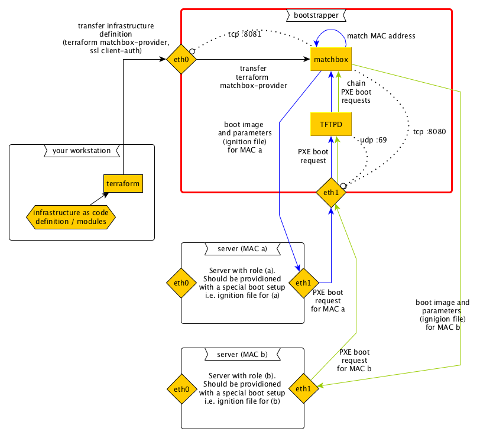

# fcos-pxe-bootstrapper
A terraform module to setup some machine with matchbox based on Fedora CoreOS, so that it can be used to bootstrap other 
machines via pxe.

Besides the matchbox service, the module 

* configures one virtual network device with a VLAN which can be used for PXE booting
* installs a TFTPD service for the configured VLAN
* installs a DNS service (power dns) for hostname resolution within the vlan

Parameters for the installed services are configurable, see modules/fcos-pxe-bootstrapper/variables.tf  

## Background

[Matchbox](https://github.com/poseidon/matchbox) is a web service that listens on a particular port and delivers PXE 
boot parameters and associated files for a PXE boot environment. It matches (hence the name) the hardware address of 
incoming requests and uses [iPXE](https://ipxe.org/start) chaining to chain to an URL with the appropriate parameters 
for the hardware address in question. It can be used to install any linux with a special configuration, e.g. a Fedora 
CoreOS with a particular ignition profile tailored to one or more special machine(s).

A PXE boot environment is necessary to use matchbox. This means, a TFDPD service must be running in an accessible
network and it must be properly configured. Technically, the machine must have *network boot* as first device in its 
boot sequence, then it searches on start for a TFTPD service on all network devices and asks it for a boot image and
parameters. The asked TFDPD then chains to matchbox, which means that actually matchbox delivers the boot images and
parameters. And matchbox first matches the hardware address and delivers the appropriate parameters.

## Description

This module takes the burden of setting up a PXE/TFTPD boot environment and matchbox. When terraform is run with this 
module, it generates an ignition file for Fedora CoreOS, which can then be used to provision any machine with a PXE boot 
environment and matchbox based on Fedora CoreOS. The services are installed as podman systemd units. For security reasons
the PXE boot should be performed on a private network rather than on a publicly visible network interface. The module
takes account of this: it is possible to configure a VLAN on a second network interface.

After provisioning a server with the resulting ignition, the bootstrapper is setup like the red box in this 
schema:



Terraform infrastructure definitions can be uploaded via the public interface (eth0 in the diagram) and ssl client-auth 
to the matchbox service. When the servers A and B are switched on for PXE boot, they discover the TFTPD service of the 
bootstrapper and make a PXE boot request to it. The TFTPD chains to matchbox, which matches the hardware address and 
delivers the appropriate boot image and parameters, resp. ignition file. The network interface eth1 in this example was
set up for private VLAN, eth0 is the public network interface.

The infrastructure definition resides in the matchbox service until it is changed. That means the servers can be
reprovisioned with the same definition whenever necessary. Changes can be made to the definitions in the local terraform
infrastructure, here on *your workstation*. The changes will be transferred to the bootstrappers matchbox
service when terraform is run on *your workstation* on the infrastructure definition. In order to apply the changes, the
servers must be flushed and restarted (yes, the whole process is based on the *throw away and rebuild* principle). Tip:
The flush on the servers can be done with dd 

```
dd if=/dev/zero of=/dev/<disk with MBR and partition table> bs=512 count=1
```

This deletes the MBR and the partition table. The disk with MR and partition table is for instance `sda`. This tip was
gracefully taken from [here](https://www.cyberciti.biz/faq/linux-clearing-out-master-boot-record-dd-command/).